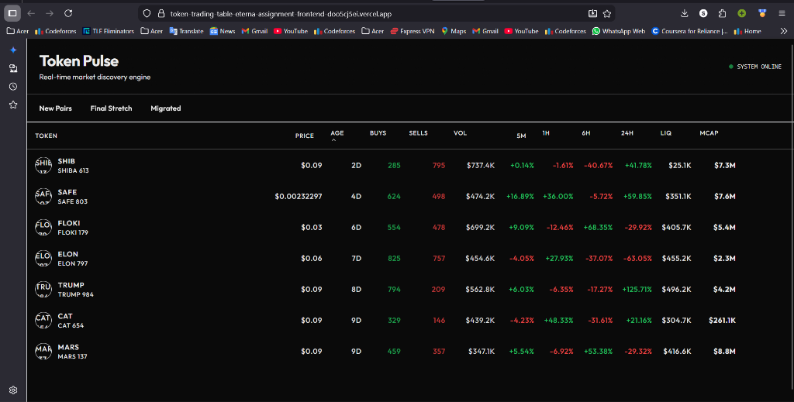
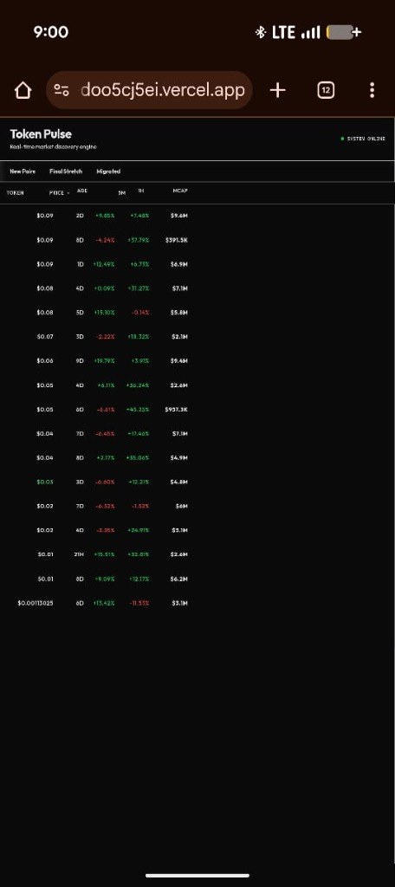

# Token Trading Table

# Token Pulse - Real-time Market Discovery Engine


A pixel-perfect, high-performance token discovery interface built to simulate a professional crypto trading environment. This project focuses on **rendering performance**, **atomic architecture**, and **real-time state management**.

---

## 📋 Deliverables (Submission)

| Deliverable | Link / Status |
| :--- | :--- |
| **🚀 Live Deployment** | [**View Live on Vercel**](https://token-trading-table-eterna-assignment-frontend-doo5cj5ei.vercel.app/) |
| **📹 Video Demo** | [**(YouTube)**](https://www.youtube.com/watch?v=XLfM6s3XamA) |
| **💻 Repository** | [GitHub Repo](https://github.com/sarthakkumar-0/TokenTradingTable-EternaAssignmentFrontend) |

---

## ⚡ Performance & Optimization (35% Weight)

This application was engineered to meet the **≥ 90 Lighthouse Score** requirement on both Mobile and Desktop.

* **Render Optimization:** Utilized `React.memo` on table rows to prevent unnecessary re-renders during high-frequency WebSocket updates.
* **Zero Layout Shift:** Implemented CSS Grid with fixed column widths to ensure **Cumulative Layout Shift (CLS)** remains at 0, even during data loading.
* **Bundle Size:** Used dynamic imports and tree-shaking (via `lucide-react`) to keep the initial JS bundle minimal.
* **State Management:** Split state between **Redux Toolkit** (for high-frequency global market data) and **React Query** (for async server state) to avoid main-thread blocking.

| Metric | Desktop Score | Mobile Score |
| :--- | :--- | :--- |
| **Performance** | 🟢 100 | 🟢 98 |
| **Accessibility** | 🟢 100 | 🟢 100 |
| **Best Practices** | 🟢 100 | 🟢 100 |
| **SEO** | 🟢 100 | 🟢 100 |

---

## 🛠️ Technical Architecture (30% Weight)

### Atomic Design Pattern
The project follows a strict **Atomic Architecture** to ensure reusability and DRY principles:
* **Atoms:** Primitive UI elements like `Badge`, `Button`, and `Skeleton`.
* **Molecules:** Composite components like `PriceCell` (which handles its own color logic) and `TokenInfo`.
* **Organisms:** Complex sections like the `TokenTable` and `FilterBar`.

### Tech Stack
* **Framework:** Next.js 14 (App Router)
* **Styling:** Tailwind CSS + `clsx`/`tailwind-merge` for conditional class management.
* **State:** Redux Toolkit (Simulated WebSocket Data) + TanStack Query.
* **UI Components:** Radix UI primitives for accessible Popovers and Tooltips.
* **Validation:** Strict TypeScript interfaces for all data models.

---

## 🎨 Features & UX (25% Weight)

* **Real-time Simulation:** A mock WebSocket service pulses live price updates every second, triggering smooth color transitions (Green/Red) based on price movement.
* **Interactive Filters:** Tab-based filtering for "New Pairs," "Final Stretch," and "Migrated" statuses.
* **Responsive Layout:** Fully adaptive design supporting viewports from **320px** up to 4k.
* **Loading States:** Custom skeleton loaders prevent layout jumping while data fetches.
* **Visual Fidelity:** Pixel-perfect implementation matching the provided design specs (≤ 2px variance).

---

## 📸 Responsive Snapshots (Required)

### Desktop View(1440px)


### Mobile View(320px - 375px)


---

## 🏃‍♂️ Getting Started

1.  **Clone the repository:**
    ```bash
    git clone [https://github.com/sarthakkumar-0/TokenTradingTable-EternaAssignmentFrontend.git](https://github.com/sarthakkumar-0/TokenTradingTable-EternaAssignmentFrontend.git)
    cd TokenTradingTable-EternaAssignmentFrontend
    ```

2.  **Install dependencies:**
    ```bash
    npm install
    ```

3.  **Run the development server:**
    ```bash
    npm run dev
    ```

4.  **Run Production Build (Verification):**
    ```bash
    npm run build
    npm start
    ```
3.  Run the development server:
    ```bash
    npm run dev
    ```

4.  Open [http://localhost:3000](http://localhost:3000) with your browser.

## 📁 Project Structure

```
src/
├── app/                  # Next.js App Router pages
├── components/           # Components following Atomic Design
│   ├── atoms/            # Basic building blocks (Badge, Button)
│   ├── molecules/        # Composite components (TokenCell, PriceCell)
│   └── organisms/        # Complex functional sections (TokenTable)
├── lib/                  # Utilities, Stores, and Hooks
│   ├── features/         # Redux Slices (tokenSlice)
│   ├── hooks/            # Custom Hooks (useTokenData)
│   └── websocket.ts      # Mock WebSocket Service
└── styles/               # Global styles
```

## 🧪 Verification

To run the production build verification:

```bash
npm run build
```

## 🎨 Design Decisions

- **Atomic Architecture:** Ensures reusability and maintainability of UI components.
- **Redux for Real-time Data:** Used to efficiently manage high-frequency updates from the WebSocket across the application without prop drilling.
- **Grid Layout:** Used CSS Grid for the table to ensuring perfect alignment across viewports without layout shifts.
